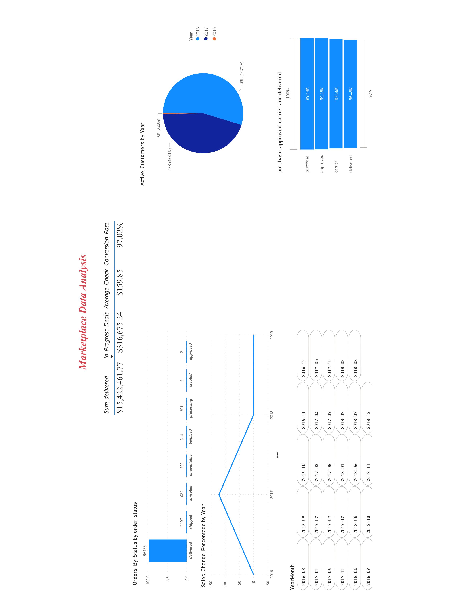
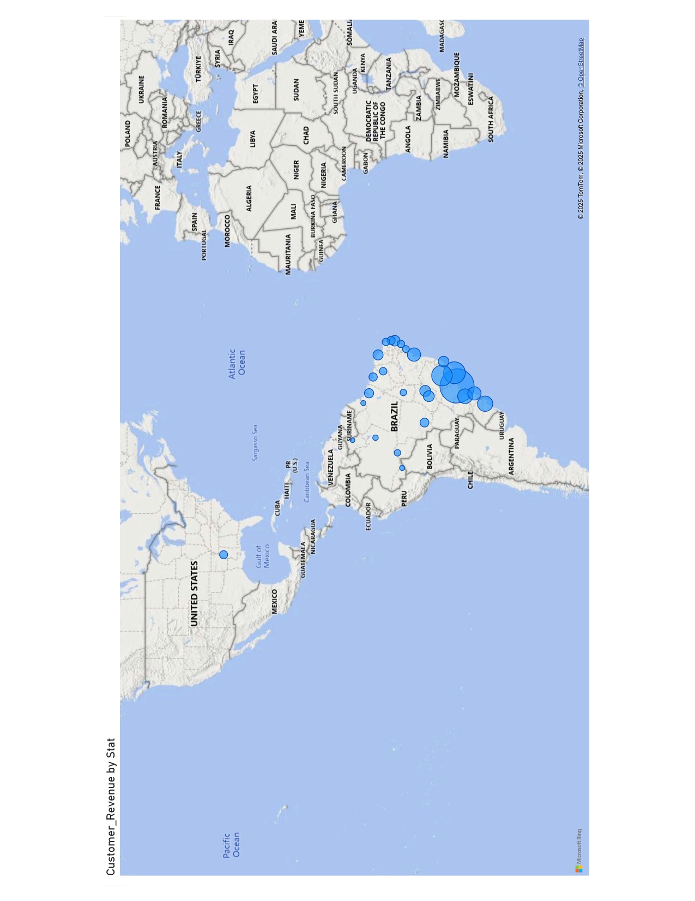

  

# 🛒 E-commerce Sales Dashboard (Power BI)

## 📦 Project Overview

This Power BI report provides a retrospective analysis of sales performance and customer behavior based on historical data from a major online retailer in the home appliances sector (up to 2018).

The goal of the project is to identify operational weaknesses and suggest potential directions for revenue growth based on past trends.

📁 The full `.pbix` project file includes **6 analytical pages** covering various aspects of e-commerce performance:

- 📦 Sales Overview
- 🗺️ Regional Performance (Map)
- ⭐ Ratings and Reviews
- 💳 Payment Behavior
- 🚚 Logistics Status
- 📈 KPI Trends

🖼️ This README shows only 2 sample screenshots — the full interactive dashboard is available in the `.pbix` file above.

## 📊 Key Insights

- Sales by category and region
- Customer activity and repeat purchases
- Identification of underperforming product segments
- Dynamic filters and time-based comparisons

## 🛠️ Tools & Features

- Power BI Desktop
- DAX measures and calculated columns
- Data modeling and relationship building
- Interactive visuals with slicers and tooltips

## 🖼️ Preview

### 📊 Main Dashboard  

### 🗺️ Map View  

## 📁 Files

- ## 📁 Files

- [Download Power BI file from OneDrive] (https://1drv.ms/u/c/407a1dfb4c438204/ET8wn49DF5hKkP9Xc9v2tWcBxLcozXyUqbcPSbNurs9uLA?e=fKmfUb))

## 👨‍💻 Author

**Yevhen Yuzhnyi**  
[LinkedIn](https://www.linkedin.com/in/yevhen-yuzhnyi/)

Add dashboard previews to README

